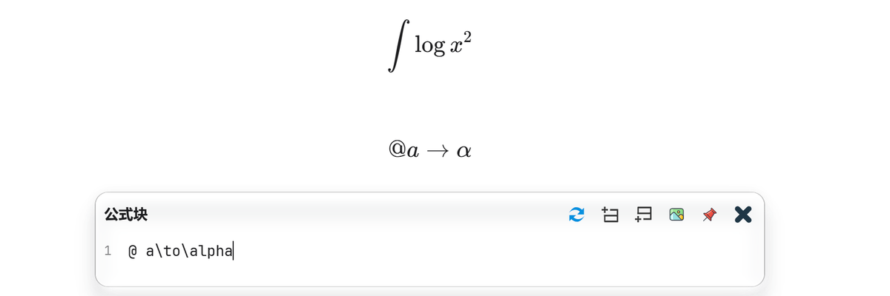

# SiYuan LaTeX Suite



A SiYuan port of Obsidian LaTeX Suite 1.12.2's math-input workflow. It supports both SiYuan's native formula source editor and the MathLive editor provided by Math Enhance.

## Features

- Source-compatible trusted JavaScript snippets: comments, nested arrays, regular expressions, function replacements and trigger variables.
- `triggerAfter`, priority, flags, custom `triggerKey`, macro/environment exclusions and LaTeX Suite option parsing.
- Captures, `${VISUAL}`, numbered/default/linked tabstops, Tab and Shift+Tab navigation, and recursive expansion.
- Auto-fractions, selection fractions, matrix and macro navigation, token-aware tabout, editor exit and automatic `\left`/`\right`.
- The user's current Obsidian LaTeX Suite snippets and variables are bundled as the initial configuration.

Open an inline equation or math block and type normally. Use `Alt+Shift+L` to toggle the plugin. The settings panel exposes the snippet source, variables and all portable input settings.

Snippet source is trusted code and follows LaTeX Suite's JavaScript format; only paste configuration you trust.

## Host-specific limitations

Conceal, Markdown inline-math decorations, colored paired brackets, cursor-bracket highlighting and dollar coloring depend on Obsidian's CodeMirror 6 decoration layer, which SiYuan's formula panel does not expose. SiYuan already supplies a live rendered formula preview; all portable formula-input behavior is implemented here.

## Build

```bash
npm install
npm run check
npm run package
```

Extract `package.zip` into `data/plugins/siyuan-latex-suite/` in your SiYuan workspace.
